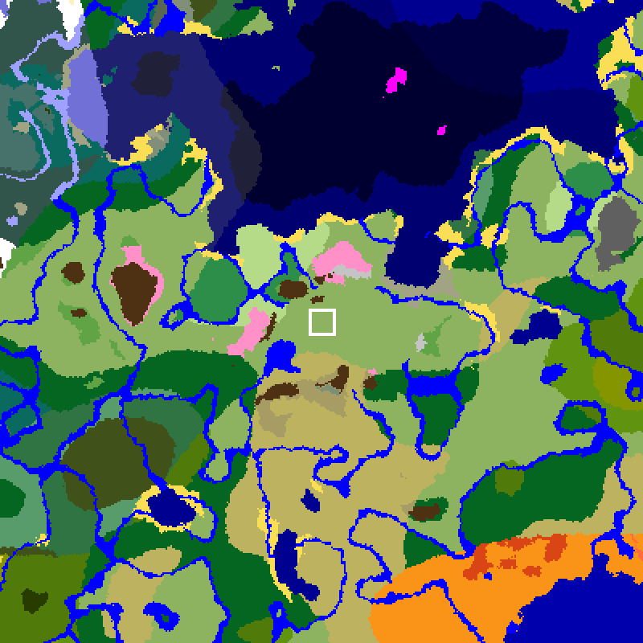

# Project status

Last updated: 2026-10-09. **Live at `esa.myminecraft.party`**, Java and Bedrock,
tested from outside. World built, template backup taken. The sign-up page at
`join.myminecraft.party` is live (deployed 2026-09-30) and the first student
sign-ups were whitelisted on 2026-10-09.

## What this is

A Minecraft server for Elstree Screen Arts students: Java and Bedrock in one
survival world, 20 players (can grow to 50), at `esa.myminecraft.party`. It runs
on the Mac Mini next to the family server. Parent-run, not a school service.

- Full design: [specs/2026-09-28-esa-server-design.md](specs/2026-09-28-esa-server-design.md)
- How to set up and run it: [../README.md](../README.md)

## How it is split

| Piece | Lives in | State |
|---|---|---|
| ESA server (compose, deploy, rollback, docs) | this repo, `main` | **running** on the Mac since 2026-09-29 |
| Relay forwarding for ESA (25566/tcp, 19132/udp) | `Chris-HT/minecraft-server`, `main` (merged as `5729df1`) | **live** on the relay since 2026-09-29 |
| DNS (`A esa`, SRV `_minecraft._tcp.esa`) | Cloudflare, zone `myminecraft.party` | **live** since 2026-09-29, DNS only (grey cloud), TTL 300 |
| Family server | `Chris-HT/minecraft-server`, `main` | unchanged, still reachable through the relay |

Key decisions:
- **Separate repo and Compose project** (`~/docker/minecraft-esa`), so nothing
  here can stop or delete the family server.
- **The relay is configured only from the family repo.** Its firewall file
  starts with `flush ruleset`, so a second copy here would wipe the family
  rules.
- The old planning branch `claude/server-scaling-50-players-h3ddrt` in the
  family repo is superseded by this repo and does not need merging.

## What is in this repo

- `docker-compose.yml`, which runs three containers:
  - `mc`: Fabric 26.2, the family mods plus Geyser, Floodgate, WorldEdit and
    Disable End (End closed with `disable_end` = true since 2026-09-29)
  - `backup`: nightly at 03:15, keeps chat logs
  - `log-prune`: deletes chat logs older than 30 days
- `.env.example`, with the chosen `SEED` (see "World seed"). Deploy refuses
  to run if `SEED` is empty.
- `ops.json`: the moderators, at level 3. It replaces an `OPS` list in
  `.env` because the image writes everyone in a list at level 4.
- `deploy.sh`, `rollback.sh`, `playtimes.sh`, `prune-branches.sh`: copied from
  the family repo and pointed at `~/docker/minecraft-esa` and the 1Password
  item "Minecraft ESA Server".
- `assets/esa-logo.png`: the ESA logo. `assets/esa.schem`: the logo as a
  WorldEdit schematic (100 x 35 x 2, concrete), made by
  `tools/logo_to_schem.py`. Preview: `assets/esa-schem-preview.png`.
- `signup/`: the sign-up page at `https://join.myminecraft.party` (Cloudflare
  Worker, D1, admin page behind Cloudflare Access). Poster QR code:
  `assets/join-qr.png`. Design: [specs/2026-09-29-signup-page-design.md](specs/2026-09-29-signup-page-design.md).
  Still on branch `signup-page`, not yet merged into `main`.

Checked on the Mac (2026-09-29): all three containers up, `mc` healthy; the
seed is right (`rcon-cli seed`); all mods load; Geyser listens on 19132/udp;
whitelist enforced; `data/ops.json` at level 3. Geyser's first start wrote
`auth-type: online`, changed by hand to `floodgate` in
`data/config/Geyser-Fabric/config.yml` (a deploy does not overwrite it).
The relay's firewall file passes `nft -c`. Not tested yet: pasting the
schematic in game, the relay, DNS, and joining from outside.

## Mod check for 26.2 (2026-09-29)

From the Modrinth API, Fabric builds for 26.2:

| Mod | Fabric 26.2 build? |
|---|---|
| `worldedit` | **Yes.** 3 builds, newest 7.4.5 (release). |
| `floodgate` | **Yes.** 2 builds, newest 2.2.6-b67 (release). |
| `geyser` | **Yes, beta only.** 61 builds, newest 2.11.3-b1247, all marked beta. The image picks release builds unless told otherwise, so `docker-compose.yml` lists it as `geyser:beta`. |

**Risk: Geyser moves on.** Geyser-Fabric follows only the newest Java version.
Once it moves to 26.3 there will be no new builds for 26.2, and when the Bedrock
app updates, an old Geyser may stop letting Bedrock players in. Plan to upgrade
to 26.3 (README "Upgrading Minecraft") soon after Geyser, Floodgate and the
other mods support it.

## World seed

`SEED=-5228782230889826103`, chosen 2026-09-28 by searching 4 million seeds
with [cubiomes](https://github.com/Cubitect/cubiomes) for a flat plains build
site at 0,0, a village in view, no pillager outpost near spawn, and lots of
biomes within walking distance. Of 44 that passed, this had the most variety
close in.

What should be there (block coordinates, distance from 0,0):

| What | Where |
|---|---|
| Build site | 0,0: plains plateau at about Y 92, flat to a block or two over ~250 x 250. Drops to a valley in the south-west, so the letters show from below |
| Natural first spawn | about -112,0, a short walk west of the site |
| Nearest village | -176,0 (176), plains, in view of the site; 11 villages within 2000 |
| Cherry grove | 200 (north-east and west of the site) |
| Savanna, snowy biomes, mountain peaks | 149, 251, 324 |
| Ocean (north) | 401, with an ocean monument at -240,-752 and 21 shipwrecks within 2000 |
| Birch forest, jungle, dark forest | 764, 826, 944 |
| Mushroom island (in the northern sea), taiga | 1105, 1069 |
| Woodland mansion | -976,688 (1194) |
| Desert, badlands (south-east) | 1294, 1360 |
| Pillager outposts | nearest -1312,224 (1331), well away from spawn |

**Checked on Chunkbase for 26.2 on 2026-09-29: it matches.** This was needed
because cubiomes models Minecraft only up to 1.21.4. To check again, open
[Chunkbase's seed map](https://www.chunkbase.com/apps/seed-map), choose Java
26.2, enter the seed and look for plains at 0,0 with a village near -176,0
and cherry groves nearby.

## Next steps

1. ~~Docker memory to 18 GB, 1Password item, deploy, Geyser `auth-type`,
   ops levels~~ Done 2026-09-29.
2. ~~Build the world~~ Done 2026-09-29: pre-generated to radius 2000, ESA
   letters, spawn platform, rules signs (`assets/rules-signs.txt`). Template
   backup taken before any student joined:
   `/Volumes/X9/backups/minecraft-esa-template/world-20260929-183757.tar.gz`
   (439 MB). Restore it to reset for a new term (README "Backups and restore").
3. ~~Relay~~ Done 2026-09-29: branch merged in the family repo, applied with
   `relay/update-relay.sh`. Cloud firewall opened for 25566/tcp and 19132/udp.
   Checked from the PC through the relay's public IP (104.248.173.45): family
   Java 25565, ESA Java 25566 and ESA Bedrock 19132/udp all answer.
4. DNS records added 2026-09-29 and checked: `esa.myminecraft.party` and its
   SRV resolve on public DNS, and Java (via the SRV) and Bedrock answer by name.
   Phone test on mobile data passed the same day: Java and Bedrock both reach
   the server and are refused by the whitelist, as they should be.
5. ~~Sign-up page~~ Deployed 2026-09-30. On 2026-10-09 the admin page's
   Added and Refused buttons returned Forbidden (fixed and redeployed the
   same day, `fd5c0c8`).
6. Put posters up (after the school's OK); pilot with about 5 students for a
   week, then open to 20.

## Open items

- ~~ESA logo file~~ Done: `assets/esa-logo.png`, turned into `assets/esa.schem`
- The school's OK on using the ESA name and logo
- ~~Your child's Minecraft username~~ Done: `Wheafus`, in `WHITELIST` and `ops.json`
- ~~The parent note~~ Done: at join.myminecraft.party/parents
- The school's OK on putting posters up (ask with the name and logo question)
- Check how Floodgate takes a Bedrock name with a space (sign-up plan Task 10
  Step 2) before the first such sign-up
- Merge `signup-page` into `main`
